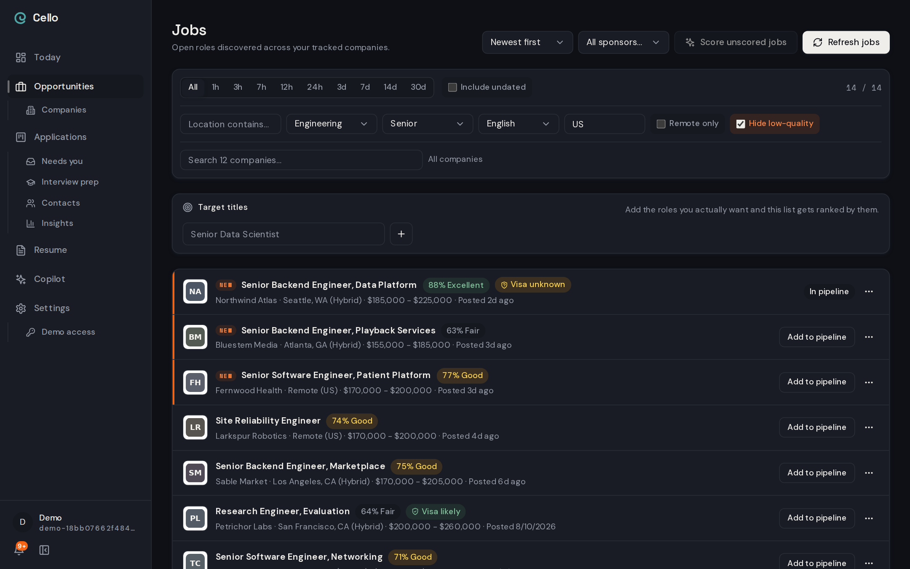
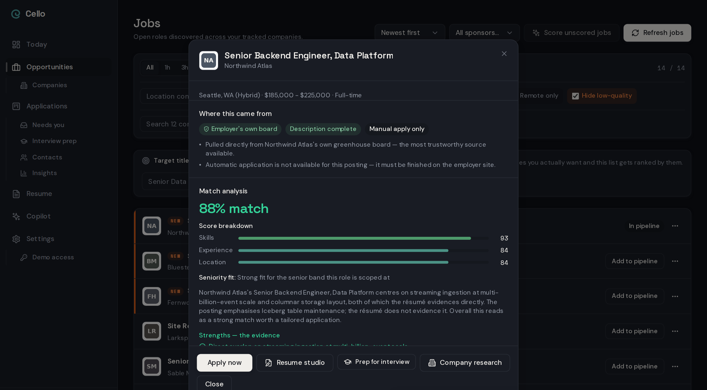
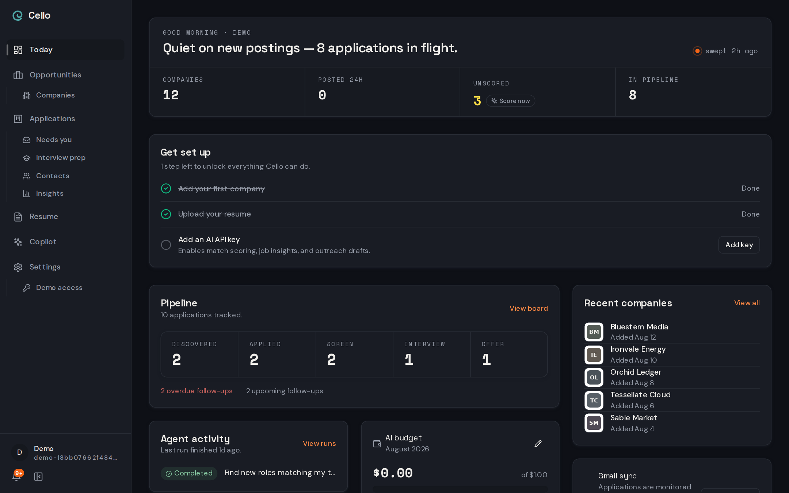

# Cello

I got tired of reading job boards, so I built the thing that reads them for me.

Cello watches the companies you care about and pulls new postings within the hour: 8 ATS providers (Greenhouse, Lever, Ashby, Workday, and friends), 11 job boards, and a scraper for the career pages that fight back, backed by a real headless browser for the ones that only render after a click. It scores each posting against your actual resume and shows its reasoning so you can disagree. Then it does the boring parts: tailors the resume, drafts the outreach, finds the one person actually worth emailing (a recruiter at Stripe, the founder at a 12-person startup), preps you for the interview, watches your Gmail so applications don't quietly die, and can drive a real browser through an application form for you to review before anything is submitted.

Bring your own Supabase project and your own API keys. There's a monthly spend cap, default $10, that no code path can route around. I've read enough "the agent burned my credits overnight" postmortems.

Under the hood it's LangGraph on a Postgres checkpointer, so runs, chats and refreshes are durable graphs: a serverless timeout pauses work instead of killing it, and a crashed invocation resumes where it stopped. Memory and retrieval are Mem0 plus pgvector, fused with plain Postgres full-text. Scraping is deterministic first; a model only gets involved when parsers genuinely can't. Seventeen agents, one contract: schema-checked in and out, metered, and anything that writes resume or outreach content gets fabrication-checked before it counts. The riskier outputs (matches, tailored resumes, outreach) get graded by an LLM judge too, and the verdict is kept, not just the score, so I can see why. Every model call and every graph run leaves a trace span behind, in Postgres, mirrored to Langfuse if you set the keys.

It also talks to other agents: an MCP server exposes the same tool set the in-app assistant uses, behind a personal access token. Those tools can read, draft, and act (score jobs, source new postings, kick off a run), but one guard sits in front of all 19 of them and refuses anything that would send mail or submit an application, no matter which tool asks. An A2A endpoint lets another agent ask the matcher, researcher or interview prepper a question directly.

Some rules are not settings. They're code, and tests fail if you break them:

- It never sends mail or submits an application you haven't read. Delivery is always your click, whether that's an email or a browser session filling out a form.
- It never invents a fact about you. Tailored output is diffed against your real resume.
- It refuses instead of guessing when a model fails or the data is too thin.
- It cannot overspend. Every model call, including embeddings and judges, passes the cap.

## What it looks like

These frames are from a demo workspace. Cello seeds one from an access code, so the companies are fictional and everything else is the real product:







## Run it

Node 20+, pnpm, and a Supabase project. Python 3.11+ if you want the scraper.

```bash
git clone https://github.com/Devil-Hawk/cello.git && cd cello
pnpm install
cp apps/web/.env.example apps/web/.env.local    # your Supabase URL + keys
# apply supabase/migrations/ in filename order, then:
pnpm dev
```

Add a model key in Settings (OpenRouter, OpenAI or Anthropic). Nothing that costs money runs until you do. Hourly sourcing and the daily digest run from `.github/workflows/` if you set the repo secrets.

## Hacking on it

```bash
pnpm lint && pnpm typecheck && pnpm test    # 3,100+ tests (plus 158 more for the Python scraper)
```

Fair warning before you "fix" a weird test: several suites are source-level scans that read *other* files and fail when new code breaks a guarantee written down elsewhere. Every route that reaches a model must pass the budget guard, every file that puts employer text in a prompt must be in a ledger, and graphs get invoked through exactly one audited door. Each scan is mutation-tested, so if it's red, it's right. Details in [CONTRIBUTING.md](CONTRIBUTING.md); security reports go through [SECURITY.md](SECURITY.md), not public issues.

## Status

I use it every day for a real job search, which is the only roadmap it has. Development lands on `staging`; `main` gets what survives. It's a self-hosted tool, not a product with a support queue, so expect some sharp edges.

MIT — see [LICENSE](LICENSE).
